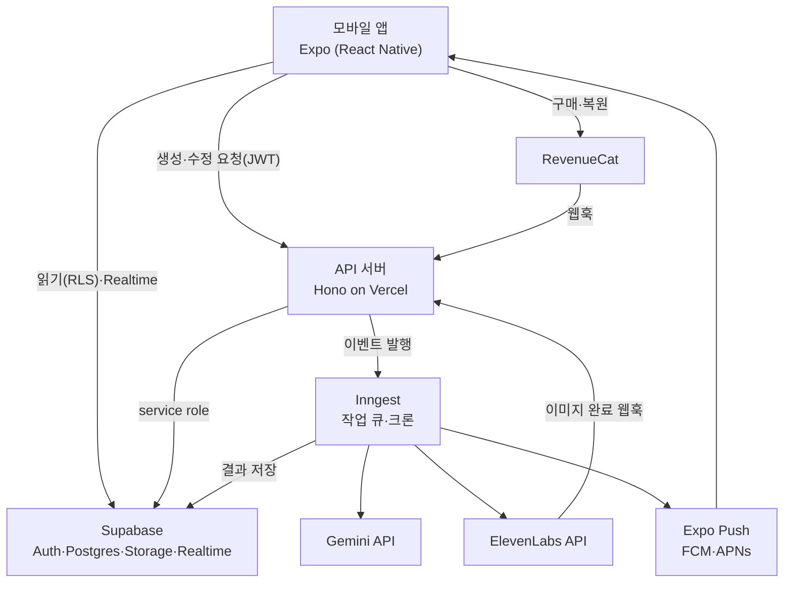
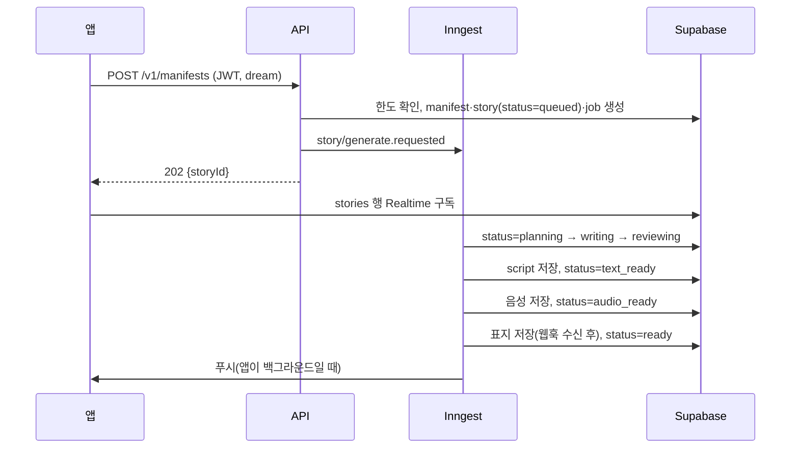

# 아키텍처

앱은 읽기를 Supabase에서 RLS로 직접 하고, 생성·결제 검증·웹훅처럼 비밀키가 필요한 일은 모두 API 서버와 Inngest 작업 큐를 거친다.

## 1. 시스템 구성



| 구성요소 | 책임 | 하지 않는 것 |
| --- | --- | --- |
| `apps/mobile` | UI, 오디오 재생, 오프라인 캐시, 구매 UI, 푸시 수신 | 외부 AI 호출, 권한 판단, 비밀키 보관 |
| `apps/api` | 인증된 요청 검증, 한도 확인, 잡 생성, 웹훅 서명 검증, Inngest 함수 호스팅 | 긴 동기 작업(모두 Inngest step으로) |
| Inngest | 생성 파이프라인, 재시도, 데일리 크론, 정리 작업 | — |
| Supabase | 데이터·파일의 단일 원천, RLS, Realtime 알림 | 비즈니스 로직(트리거는 `updated_at`, 프로필 생성 정도만) |
| `packages/providers` | Gemini·ElevenLabs 호출, 재시도, 타임아웃, 비용 계산 | 앱에서의 사용 |

## 2. 요청 흐름

### 2.1 스토리 생성



상태 값과 전이는 `docs/AI_PIPELINE.md` 3절을 따른다. 앱은 `text_ready`부터 읽기 모드, `audio_ready`부터 재생을 허용한다.

### 2.2 결제

1. 앱은 RevenueCat SDK로 구매하고, `appUserID`는 Supabase `auth.uid()`로 설정한다.
2. RevenueCat 웹훅 → `POST /v1/webhooks/revenuecat` → `subscriptions` 갱신(멱등: 이벤트 id 저장).
3. 생성 API는 `subscriptions`만 보고 권한을 판단한다. 앱의 entitlement는 화면 잠금 표시용이다.

### 2.3 인증

- 퀴즈는 Supabase 익명 로그인으로 시작하고, 페이월 직전에 Apple·Kakao·Google 계정을 연결한다. 익명 사용자에 소셜 계정을 연결하는 방식(링크 vs 새 로그인 후 데이터 이관)은 1주차에 확인해 `DECISIONS.md`에 기록한다.
- Kakao: `@react-native-seoul/kakao-login`으로 id_token을 받아 `supabase.auth.signInWithIdToken({ provider: 'kakao', token })`. 카카오 콘솔에서 OpenID Connect 활성화 필요. audience 오류가 나면 브라우저 OAuth(`expo-web-browser`)로 대체.
- Apple: `expo-apple-authentication` → `signInWithIdToken({ provider: 'apple' })`.
- 세션은 `expo-secure-store` 어댑터로 저장한다.

### 2.4 데일리 스토리

Inngest 크론(매시 정각) → 해당 시간대에 알림을 받을 사용자 중 **최근 3일 안에 앱을 연 구독자**만 골라 데일리 생성 → 완료 시 푸시. 나머지 사용자는 앱을 열 때 `POST /v1/daily`로 즉시 생성.

## 3. 앱 내부 구조

```text
apps/mobile/
├─ app/
│  ├─ _layout.tsx              # Providers: Query, Auth, Player, RevenueCat
│  ├─ (onboarding)/            # splash, quiz/[step], first-manifest, paywall, link-account
│  ├─ (tabs)/                  # index(홈), library, rituals, me
│  ├─ manifest/[id]/progress.tsx
│  ├─ player/[storyId].tsx     # 모달 풀 플레이어
│  └─ story/[storyId]/text.tsx # 전체 스토리 보기
└─ src/
   ├─ audio/        # player-store(zustand), use-story-player, soundscape-mixer, lock-screen
   ├─ offline/      # download-manager, storage paths
   ├─ billing/      # revenuecat init, use-entitlement
   ├─ notifications/# register-token, handlers, deep links
   ├─ lib/          # supabase client, api client(fetch + zod), analytics
   ├─ i18n/ko.ts
   ├─ theme/        # 디자인 토큰
   └─ features/     # quiz, manifest, library, rituals, affirmations, gratitude, wall, profile
```

- 서버 상태는 TanStack Query, 재생 상태(현재 트랙, 위치, 배경 사운드)만 Zustand.
- 미니 플레이어는 탭 위에 고정, 탭하면 풀 플레이어 모달.

## 4. 오디오 설계

- `setAudioModeAsync({ playsInSilentMode: true, shouldPlayInBackground: true, interruptionMode: 'doNotMix' })`.
- 스토리 플레이어 = 잠금화면 활성 플레이어(`setActiveForLockScreen(true, { title, artist: 'Eloria', artworkUrl })`). Android는 이걸 켜지 않으면 백그라운드 약 3분 후 멈춘다.
- 배경 사운드 = 두 번째 플레이어, 반복, 볼륨 0.0~0.5. 잠금화면 컨트롤은 스토리 플레이어만.
- **검증 필요**: 2트랙 동시 재생이 iOS·Android 잠금화면 상태에서 유지되는지. 실패하면 대안 A(서버에서 스토리+배경 사운드 사전 믹스 버전 생성) 또는 대안 B(react-native-track-player 전환) 중 하나를 `DECISIONS.md`에 기록하고 진행.
- 재생 위치는 5초마다 로컬 저장, `play_events`는 25/50/75/90% 도달 시와 종료 시 전송.

## 5. 오프라인

- 다운로드 경로: `FileSystem.documentDirectory/audio/{storyId}-{assetVersion}.mp3`.
- 재생 소스 결정: 로컬 파일 → 없으면 서명 URL(만료 1시간, 만료 시 재발급).
- 구독 만료 감지 시 유료 콘텐츠 다운로드 삭제.

## 6. 보안

- API는 모든 요청에서 Supabase JWT를 검증하고 `user_id`를 토큰에서만 얻는다.
- 웹훅: RevenueCat은 Authorization 헤더 시크릿, ElevenLabs는 서명 검증. 실패 시 401, 처리 결과는 멱등.
- 레이트 리밋: 사용자당 생성 요청 분당 3회, 일일·월간 한도는 `AI_PIPELINE.md` 6절.
- 로그에 꿈 원문·스크립트를 남기지 않는다(Sentry `beforeSend`에서 제거).
- 개인정보: 꿈·목표 텍스트는 Gemini·ElevenLabs로 전송된다(국외 이전). 처리방침에 명시하고, 계정 삭제 시 DB 행과 스토리지 파일을 모두 지운다(`deletion_requests` → Inngest `user/delete.requested`).

## 7. 환경

| 환경 | 앱 | API | DB |
| --- | --- | --- | --- |
| local | 개발 빌드 + `pnpm dev:mobile` | `pnpm dev:api` + Inngest dev | 로컬 Supabase(`supabase start`) |
| staging | EAS `preview` 프로필, TestFlight·Play 내부 테스트 | Vercel preview | Supabase staging 프로젝트 |
| production | EAS `production` | Vercel production | Supabase production 프로젝트 |

API 서버의 Inngest 함수 한 step이 Vercel 함수 최대 실행 시간 안에 끝나야 한다. v3 음성 1회(최대 5,000자)가 가장 긴 step이므로 1주차에 실측하고, 부족하면 Vercel 설정을 늘리거나 API를 다른 런타임(Fly.io 등)으로 옮긴다.
